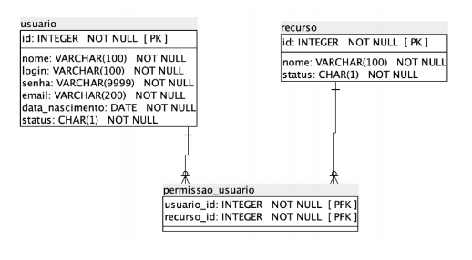
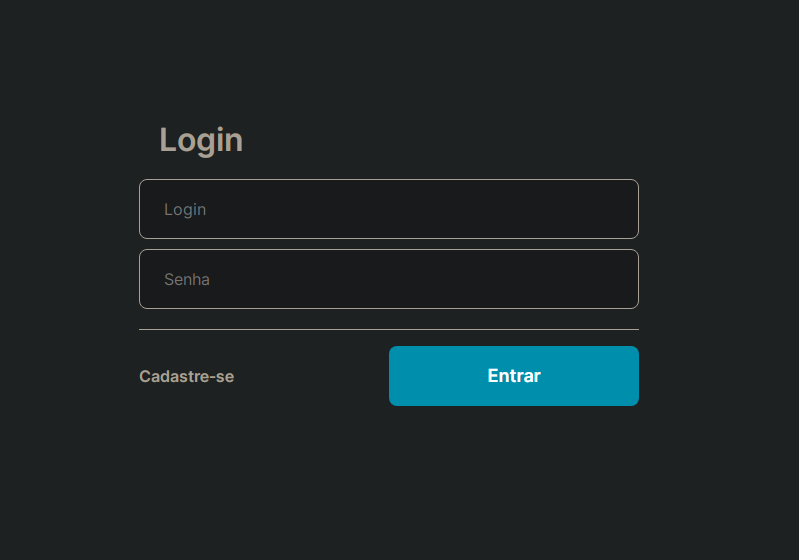
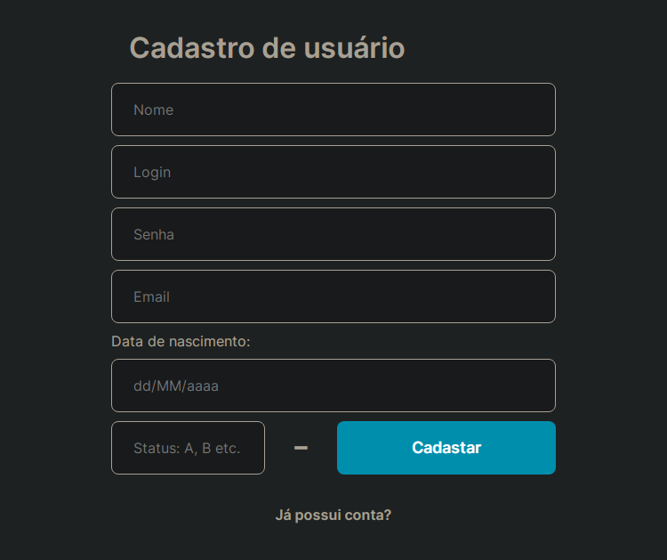
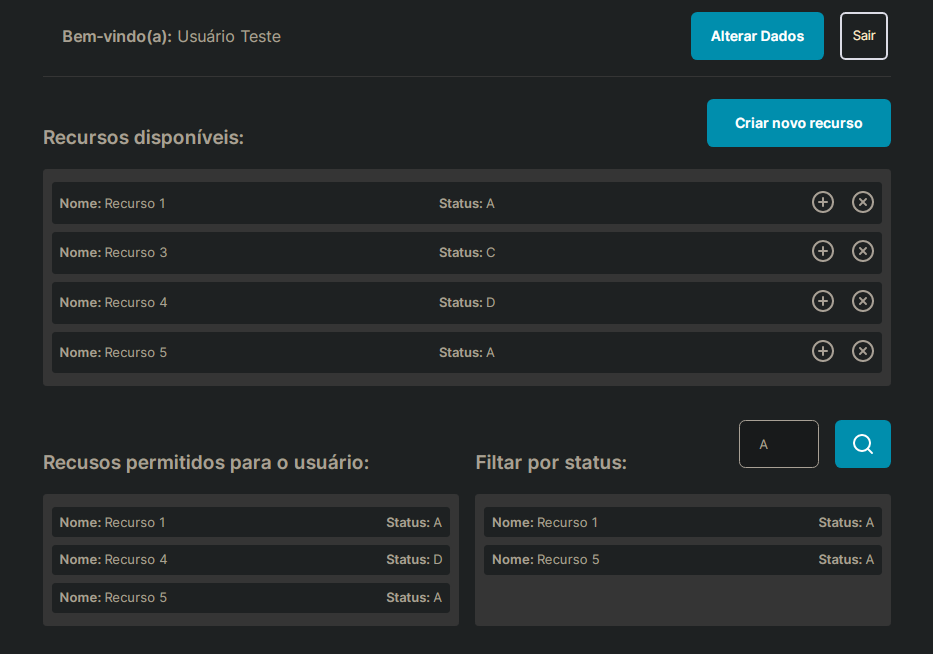

# Controle de permissão de usuário

Atividade de programação da disciplina Web I do curso de bacharelado em Sistemas de Informação. Desenvolvida com Spring Boot no backend e para a apresentação das informações foi utilizado React JS.

## Diagrama:



-----------------

## Definindo base de dados no banco MySQL:

```sql
CREATE DATABASE web_i;

USE web_i;

CREATE TABLE usuario (
	id INTEGER(99) NOT NULL AUTO_INCREMENT,
	nome VARCHAR(100) NOT NULL,
	login VARCHAR(100) NOT NULL,
	senha VARCHAR(9999) NOT NULL,
	email VARCHAR(200) NOT NULL,
	data_nascimento DATE NOT NULL,
	status CHAR(1) NOT NULL,
	PRIMARY KEY (id)
);

CREATE TABLE recurso (
	id INTEGER(99) NOT NULL AUTO_INCREMENT,
	nome VARCHAR(100) NOT NULL,
	status CHAR(1) NOT NULL,
	PRIMARY KEY (id)
);

CREATE TABLE permissao_usuario (
	usuario_id INTEGER(99) NOT NULL,
	recurso_id INTEGER(99) NOT NULL,
	FOREIGN KEY (usuario_id) REFERENCES usuario(id) ON DELETE CASCADE,
	FOREIGN KEY (recurso_id) REFERENCES recurso(id) ON DELETE CASCADE,
	CONSTRAINT pk_permissao_usuario PRIMARY KEY (usuario_id, recurso_id)
);
```
-----------------

## Definindo a conexão com o banco:

```properties
# Selecionando o banco
spring.datasource.url=jdbc:mysql://localhost/web_i?createDatabaseIfNotExist=true&useTimezone=true&serverTimezone=UTC

# Definindo acesso a base de dados
spring.datasource.username=root
spring.datasource.password=root

# Opicional
spring.jpa.show-sql=true

spring.jpa.hibernate.ddl-auto=update
```
-----------------

##  Execultando o projeto

+ ### Back-end

Para iniciar o back-end é necessário abrir a pasta *📂 backend* como um projeto `Marven` e instalar as denpendências presentes no arquivo `pom.xml`.

Em seguida na pasta *📂 src* > *📂 main* > *📂 java* > *📂 com* > *📂 web1* > *📂 web1* execute o arquivo *📄 Web1Application.java*

O projeto irá rodar em [http://localhost:8080](http://localhost:8080).

-----------------

+ ### Front-end

Para iniciar o front-end é necessário ter o [NodeJS](#) instalado em sua máquina.

Em seguida é necessário instalar as dependências do projeto. Na pasta *📂 frontend*, execute o comando:

```
    npm install 
```
Para iniciar o projeto basta rodar o comando:
```
    npm start 
```
OU caso você tenha o [Yarn](#) instalado:
```
    yarn start 
```
A aplicação irá ser aberta em: [http://localhost:3000](http://localhost:3000).

-----------------
## ScreenShots:

+ ### Tela login



+ ### Tela Cadastro



+ ### Tela Perfil


